<!-- Begin README -->


<p align="center">
    <a href="https://swiftversion.net/">
        
    </a>
    <a href="https://support.apple.com/en-us/HT213407">
        
    </a>
    <a href="https://support.apple.com/en-us/HT213436">
        
    </a>
    <br>
    <a href="https://github.com/scottgriv">
        
    </a>
    <a href="mailto:scott.grivner@gmail.com">
        
    </a>
    <a href="https://www.buymeacoffee.com/scottgriv">
        
    </a>
    </a>
        <a href="https://github.com/scottgriv/PRG-Personal-Repository-Guidelines">
        
    </a>
</p>

-------
# Post.e

**Post.e** is a fully functional, multi-programming language, "how-to-build" social media application.

* Create a user profile, follow other users, and post messages similar to Twitter. 
* Share content with other users by attaching photos, videos, documents, and files to your Posts. 
* Written in Swift & Objective-C for the front-end and multiple back-end languages such as PHP, Python, Node.js, Ruby, Go, Java, Rust, and Perl. 
* Includes a back-end MySQL database, JSON interchange, and multiple out of the box APIs. 
* Designed to teach people how to build their own social media app in mind.

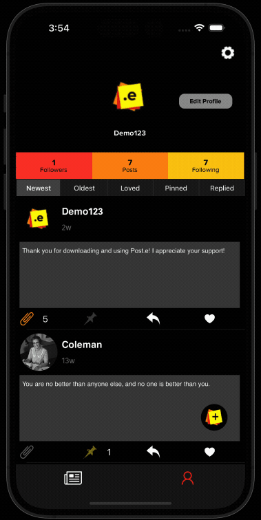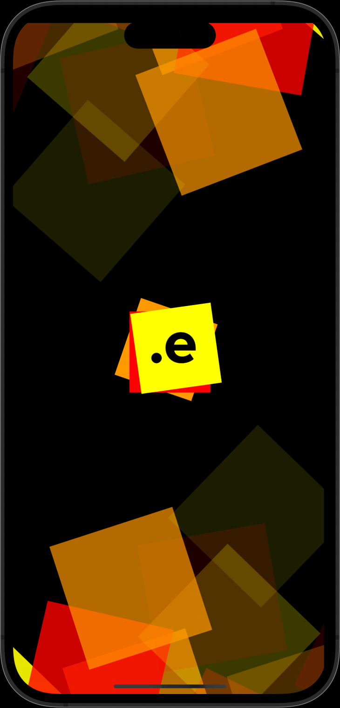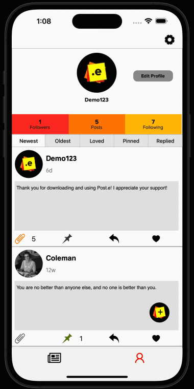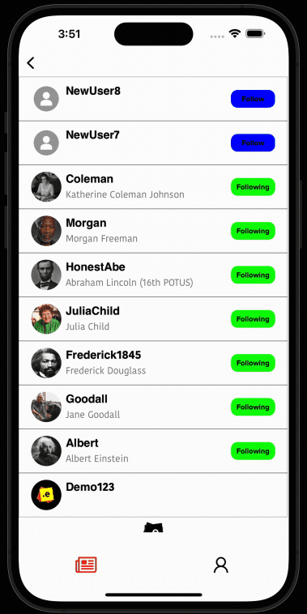

-------

## Table of Contents

- [Background Story](#background-story)
- [Definitions](#definitions)
- [Limitations](#limitations)
- [Features](#features)
- [Programming Languages](#programming-languages)
- [What's Inside?](#whats-inside)
- [Getting Started](#getting-started)
- [Future Plans](#future-plans)
- [Contribution](#contribution)
- [Project](#project)
- [License](#license)
- [Credit](#credit)

-------

## Background Story

I had two goals when I originally started this project:
1. Demonstrate how to make a "*Twitter-esque*" social media application.
    - Many people underestimate the amount of time and work involved in making a social media application.
    - There's a lot of confusion around what the tech stack consists of (client-side code, back-end code, a database, and a web-server of some kind).
    - I wanted to shine a light on the above processes and the technology involved.
2. Create the application in as many languages as possible and use the project as a learning tool for myself.
    - I wrote the application with a mix of both `Objective-C` and `Swift` to demonstrate how a `Bridging Header` file allows the two languages to share classes/files between each other. 
    - I'm constantly learning new programming languages and frameworks. I wanted to build a "one stop shop" mobile application as a sandbox for all of these languages.
    - I started building the application back-end with ``PHP`` because it's easy for others to understand. In the future, I'm going to try to utilize languages like ``Go`` and ``Node.js``. The multithreading capabilities of these languages to significantly speed up server request & response processing makes them an obvious choice to work on next.
    - I've realized now, by open-sourcing it, there's an opportunity for others to learn and contribute to it as well.
    
*I know this is a lengthy README, but I want to explain every detail of the application for teaching/learning purposes. If this repo gains traction, I will add a lot of these details into github-pages/documentation or separate markdown file to remove clutter in the README. I appreciate it if you make it to the end!*

## Definitions:
> A **Post** is any message posted to **Post.e** which contains text and/or attachments that may contain photos, videos, or a wide variety of file types. View the `extension` table in the database to view the supported file types. Tap the Post button to post the message to your profile.

> **Posts** are the de facto form of communication in **Post.e** (similar to a [Tweet](https://help.twitter.com/en/resources/new-user-faq)).

> **Posts** were inspired by the popular office supply product [Post-It Notes](https://en.wikipedia.org/wiki/Post-it_Note) due to their ability to easily communicate messages and attach them to surfaces. Virtual **Posts** in **Post.e** offer a similar functionality. 

## Limitations:
**Posts** are limited to:
- Post character limit: There is no hard limit for the number of characters, however, the database type and length is `VARCHAR(250)` and it cannot be `NULL`.
- Attachment limit per Post: 9.
- Max file size per Attachment: 1 gigabyte (GB) or 1,073,741,824 bytes.

Currently, the `Post.swift` file contains the static values mentioned above. In the future, I'd like to sync this to the `parameter` table in the database for a more dynamic approach, including a max character limit for Posts and an alert message if the Post limit has been exceeded.

## Features:
--- 
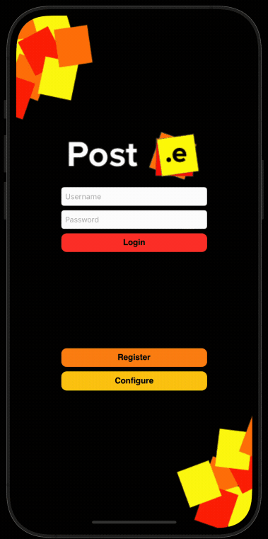

- **Login & Register Screens:** 
    - Single Sign-On (SSO) capabilities by using a combination of Swift's [UserDefaults](https://developer.apple.com/documentation/foundation/userdefaults) class and server side session handling. Login once then automatically login in the future without signing in (unless, of course, you log out of the app which kills the active session in the `session` table).
    - Username & Password validations.
        - Checks for minimum password length, min/max user name length, missing or empty fields, matching passwords, and invalid characters using `REGEX` patterns. 
    - Registering a User will create a new folder in the `server/uploads` folder using the new `Prof_ID` column value, which is an `AUTO_INCREMENT` column in the database (Posts work in this same fashion).
    - A unique `ID` is also generated using the `encoder.[language]` file using `Base 64 Encoding` to produce a unique external facing `ID`, stored in the database under the `Prof_Key` or `Post_Key` columns, that can be used to share Posts or Profiles in the future.
---
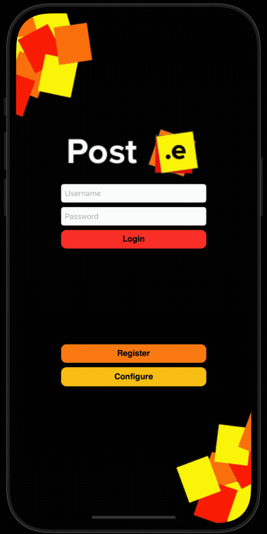

- **Configure Programming Language Screens:** <br>
    - Pick the server side language you want **Post.e** to use. This will route the requests to the toggled language folder.
    - See [Programming Languages](#programming-languages) below for more details on this screen.
---


- **Feed Screen:** <br>
    - Sort Posts by *Newest*:
        - *Newest* consists of the most *recent* posts using the `Post_Created` date column in descending order.
        - `WHERE Post_Created DESC`.
    - Sort Posts by the *Home* experience:
        - *Home* uses a number of columns to create a fun user feed experience using the below `WHERE` clause:
        - `WHERE Post_Love_Count DESC, Post_Pin_Count DESC, Post_Reply_Count, Post_Created DESC`.
    - Click on the Profile name to segue to the user Profile screen.
---


- **Interaction Screen:** <br>
    - View New Users on the App.
    - Click on the Profile name to segue to the user Profile screen.
    - Follow or Unfollow users directly from this screen.
---


- **Profile Screen:** <br>
    - Interactive Follower, Following, and Post count buttons that will segue to the Interaction screen when clicked.
        - The Post count is not a button, its a Post total (including Replies) counter only.
    - Profile picture display.
    - Click the Profile tab icon to scroll to the top.
    - Pull refresh to get the most recent Posts.
    - Post button to create new Posts.
    - Sort Posts on the Profile feed by: Newest, Oldest, Loved, Pinned, and Replied counts in descending order.
    - Edit Profile
        - Change your Profile picture (take a photo or select one from your library).
        - Remove your Profile picture - setting it to the default placeholder image.
        - Update your Profile Username (it must be unique) and Profile Name.
        - Delete your Profile.
    - Scroll to the bottom of the Table, Posts will load in 25 Post chunks. If the Post # > 25, a request will be sent to the server and an activity indicator will be shown in the Table footer as it fetches the next chunk of 25.
    - Within the Post Cell:
        - Preview & Save Attachments.
        - Pin or Unpin a Post.
            - Pins will be displayed on your Profile.
            - You cannot Pin a Reply or Posts that you created.
            - Only Posts displayed on Profiles or your Feed can be Pinned.
        - Reply to a Post.
        - Love or Unlove a Post.
        - Delete your own Posts.
    - Click on the Profile name to segue to the user Profile screen.
---
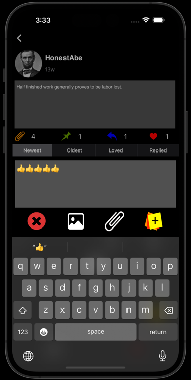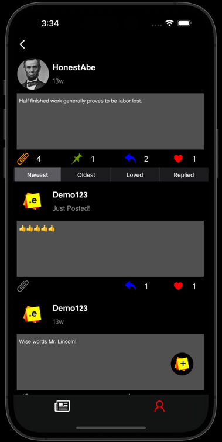

- **Reply Screen:** <br>
    - Reply to a Post on a dedicated screen with the Post you're replying to in the header.
    - Reply to a Reply (there is no limit on the Reply depth).
    - Sort Posts on the Reply feed by: Newest, Oldest, Loved, and Replied counts in descending order.
---
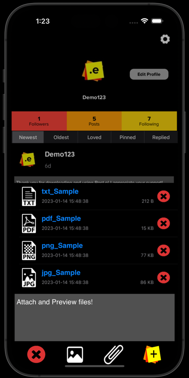

- **Post Screen:** <br>
    - Type up a Post.
    - Cancel the Post by clicking the Cancel button or the visible Profile Screen.
    - Add Photos/Videos from your Camera or Photo Library.
    - Add Attachments (**Post.e** comes with a demo directory with a few files ready to select) - see screenshot above.
    - Submit the Post to the server.
    - Haptic Feedback and Audible Post Alert after a Post has been successfully sent to the server.
---
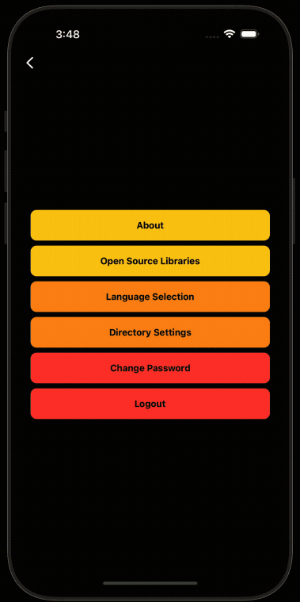

- **Settings:** <br>
    - About section to view the current **Post.e** version number (derived from the `info.plist` value of `CFBundleShortVersionString`).
    - Open Source Libraries used to create **Post.e** and their related LICENSE files.
    - Language Selection displays your current Device Language, available Languages supported by **Post.e** as well as a link to your Settings screen to change your device language (this will cause the application to restart as per Apple).
    - Directory Settings displays your current folder directory used to select files for Post Attachments. Toggle the "Use Sample Directory" switch to use the sample files provided with **Post.e** by default or not.
    - Change your Password
    - Logout of the Application (which will also kill the session on the server).
---
 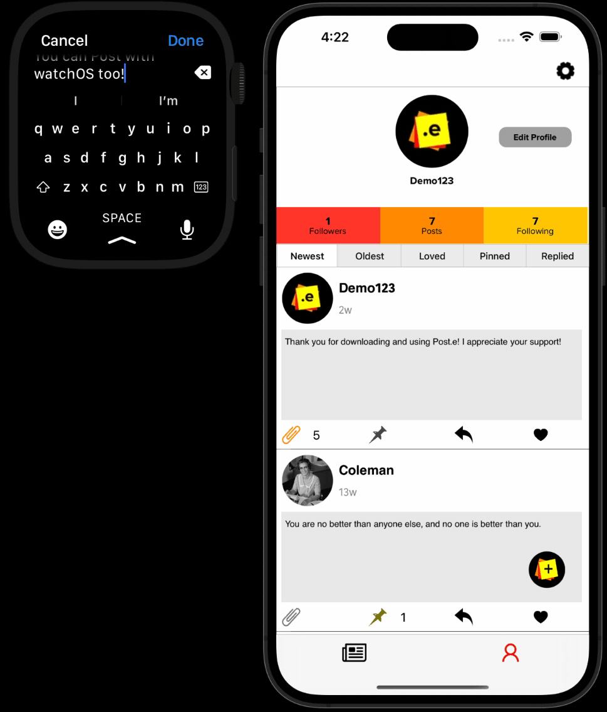

- **watchOS Support:** <br>
    - Post to your Profile using audio to text or by typing in the text using the watch keyboard.
    - Haptic Feedback and Audible Post Alert after a Post has been successfully sent to the server.
---
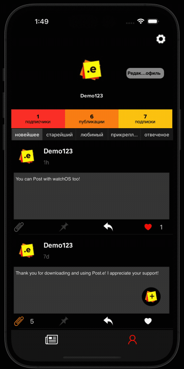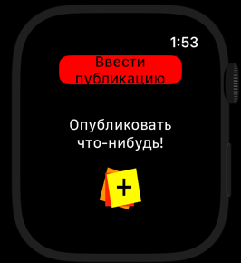

- **Language Support:** <br>
    - English and Russian language support using [Localization](https://developer.apple.com/localization/). Query the `language` table in the database to view the supported languages.
---
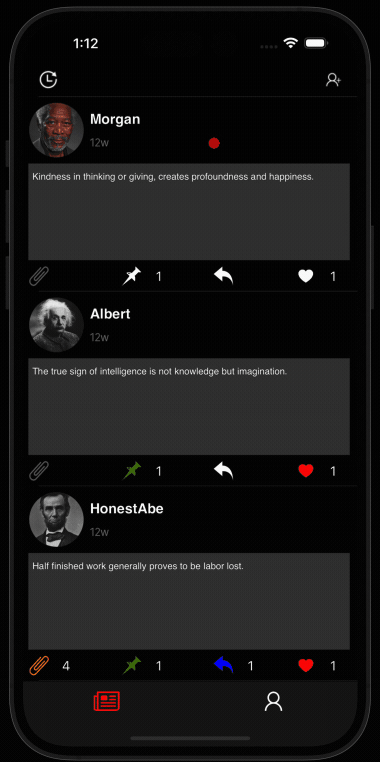

- **Dark Mode Support:** <br>
    - Easily toggle Designs between Light and Dark Mode.
---
- **API:**
    - Navigate to the `api` folder to access the API collection `.json` file used to import APIs into Postman. 
    - Open the `apis.[language]` file to view the list of available APIs and usage. 
---
- **Interchange:**
    - **Post.e** uses URL encoded requests (passing the parameters in the URL) via `application/x-www-form-urlencoded`, i.e.:

    ```
    htt://localhost/Post.e/server/languages/php/login.php?command=Session&tokenID=4e1073c9b370ccf8f4ee454c6a841492
    ```
    
    For responses, **Post.e** uses JSON encoding via `application/json; charset=utf-8`, i.e.: 

    ```
    {
        "success": 1,
        "tokenID": "50f20dd3e6761245655c8df0cfd73c05",
        "token": 1
    }
    ```

---
- **Database:**
    - **Post.e** uses the MariaDB flavor of MySQL named `post.e` or `post.e_demo`, depending which one you install. Below are the db specs using the schema inspector:

    | Specification                  | Value              |
    |--------------------------------|--------------------|
    | Default Collation              | utf8mb4_unicode_ci |
    | Default Characterset           | utf8mb4            |
    | Table Count                    | 21                 |
    | Database Size (rough estimate) | 624.0 KiB          |

---

## Programming Languages

Below is a running list of languages currently supported by **Post.e**:

| **Language & Progress:**                                                                                            | **Version** |
|---------------------------------------------------------------------------------------------------------------------|-------------|
|                         | 5.7         |
|                        | 4.0         |
|                               | 8.1.6       |
|                 | 3.11.0      |
|               | 18.12.1     |
|                       | 2.6.10      |
|                             | 1.19.3      |
|                               | 1.64.0      |
|                               | 5.30.3      |
|                                         | 17.0.5      |
|                       | 10.4.21     |

## What's Inside?
A quick look at the top-level files and directories in this project.

    .
    ├── api
        ├── PHP - Post.e API.postman_collection.json
    ├── db
        ├── mysql
            ├── post_e.sql
            ├── post_e_demo.sql
            ├── post_e-eer.mwb
    ├── docs
        ├── images
            ├── (GitHub README images)
    ├── mobile
        ├── ios
            ├── Playgrounds
            ├── Post.e
                ├── (iOS directory files)
            ├── Post.e_Watch
            ├── Post.e_Watch WatchKit Extension
                ├── (watchOS directory files)
            ├── Post.e-Test
            ├── Post.e.xcodeproj
            ├── Post.eTests
            ├── Sample Files
                ├── jpg_Sample.jpg
                ├── pdf_Sample.pdf
                ├── png_Sample.png
                ├── txt_Sample.txt
    ├── server
        ├── languages
            ├── go
            ├── java
            ├── js
            ├── php
                ├── (php directory files)
            ├── pl
            ├── py
            ├── rb
            ├── rs
        ├── resources
            ├── logs
                ├── current_date.log (i.e. log_21-Jan-2023.log)
            ├── config
                ├── config.ini
        ├── uploads
            ├── prof_id (i.e. 1, 2...37, 38)
                ├── prof_id.jpg (i.e. 1, 2...37, 38).jpg
                ├── posts
                    ├── post_id (i.e. 45, 46...103, 104)
                        ├── file name (i.e. jpg_Sample.jpg, pdf_Sample.pdf, etc.)
    ├── .gitattributes
    ├── .gitignore
    ├── LICENSE
    ├── README.md
    └── VERSION

1. **`/api`**: This directory contains the Postman API import file which sends requests to the `apis.[language]` file.
2. **`/db/mysql`**: This directory contains the install files for the **Post.e** database, a demo database, and a EER Diagram of the database.
3. **`/docs/images`**: Images used for the GitHub README relative path.
4. **`/mobile/ios`**: The directory where the iOS and watchOS files are stored.
5. **`/server/languages`**: The directory where the server side languages are stored.
6. **`/server/resources`**: The directory where the log files and `config.ini` file used for the database connection are stored.
7. **`/server/uploads`**: The directory profile images and post images/files download to.
8. **`.gitattributes`**: The `.gitattributes` file allows you to specify the files and paths attributes that should be used by git when performing git actions, such as `git commit`, etc.
9. **`.gitignore`**: The `.gitignore` file tells git which files it should not track / not maintain a version history for. 
10. **`README.md`**: A text file containing useful reference information about this project (the file you're reading this from now).
11. **`LICENSE`**: The application license file.
12. **`VERSION`**: A file containing the current application version number.

## Getting Started
- Download the application from here, Github.
- Place the `server` file on your web server.
- Ensure you have the proper language frameworks and versions installed to integrate **Post.e** with. 
    - See [Programming Languages](#programming-languages) above for the current list of version numbers.
- Import the provided `MySQL` database structure into your database using either the `db/mysql/post-e.sql` file or the `db/mysql/post-e_demo.sql` file.
    - The `post-e.sql` file is a blank/empty database/sandbox.
    - The `post-e_demo.sql` file contains sample data (recommended for demoing or learning purposes).
- Edit the `resources/config.ini` file with your database credentials.
    - This will be used to connect to the database in all language variations. 
- Ensure the proper ports are open for your `localhost` web server and database.
- Run the **Post.e** app in `Xcode` located in the `mobile/ios` folder.
    - Wait for the required packages to download in Swift Package Manager (SPM).
    - Change your scheme to `Post.e-Test` to view Profile ID and Post ID values in the Tableview.
    - **Post.e** was tested with the following devices/simulators:
        - iPhone 14 Pro Max
        - iPhone 14 Plus
        - Apple Watch Series 8 (41mm)
        - Apple Watch Series 8 (45mm)
        - More Devices to be added in the future (layouts may vary due to constraint issues depending on your unsupported Device)
- Login with the following:
    - If you're using the Demo database, login with the following credentials: 
        - **User:** Demo123
        - **Password:** appdev123
    - If you're using the empty database, you will have to build up the app database by registering new users.
- Click Login! Enjoy!

**NOTE:** 
- All of the demo accounts in the database use the password above. 
- Passwords are hashed using `SHA512` and `Salted`.
- The demo accounts consist of quotes from famous individuals that have inspired me through their works and words.

## Future Plans

- Besides making **Post.e** compatible with more back-end languages, devices, and the tasks mentioned in the Backlog (i.e. Editing Posts, Push Notifications, etc.), I'm considering eventually hosting it on a server so it's not constrained to a local environment. This way, the demo will have a sandbox for everyone to interact in. I don't plan on making it an actual social media app - it was created as a learning tool for all, and I'd like to keep it that way.
- I designed the app icons and banners myself, however, as you all know - Design is a full time job and hard to balance with programming. A lot of the buttons and interactive icons were taken from free design websites. I'd like to eventually create and plug in custom designs into the application for a better user experience and flow.
- I intend to add more documentation around app navigation as well as an in-depth dive into the underlying technology used within the app. As I mentioned above, I want this to be used as a learning tool and solid documentation is a *must have* as a teaching tool; I will probably utilize github-pages or a separate markdown file for documentation (stay tuned).

## Contribution

I'm looking forward to working with others on this project over time (of course, when time is permitted) and seeing where it goes. Feel free to Fork the Repo and submit a Pull Request if you've contributed to it in some way (and don't forget to add yourself to the [CREDIT](CREDIT) document as well). If you're going to Fork the project or Clone the project for your own purposes, all I ask is that you follow the attached license as well as giving me credit using the below **Credit** block. I spent a lot of time on this and I'm proud of how it turned out. I'm more than happy to open-source it to help others as long as credit is given and no profit is gained from it in return; this is "the people's" social media app.

Feel free to reach out to me using my email below if you have any questions or suggestions.

Thanks and enjoy! (and I appreciate it if you've read this far - you're a legend!)

## Project

Please reference the [GitHub Project](https://github.com/users/scottgriv/projects/3) tab inside this Repo to get a good understanding of where I'm currently at with the overall project. Bugs and Enhancements will also be tracked there as well.

## License
**Post.e** is released under the **GNU General Public License v3.0 License**. [See LICENSE](LICENSE) for details.

## Credits
**Author:** Scott Grivner <br>
**Email:** scott.grivner@gmail.com <br>
**Website:** [scottgrivner.dev](https://www.scottgrivner.dev) <br>
**Reference:** [Main Branch](https://github.com/scottgriv/Post.e) <br>
<div align="center">
    <a href="https://github.com/scottgriv/Post.e" target="_blank">
        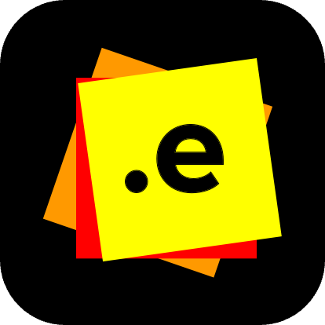
    </a>
</div>

<!-- End README -->